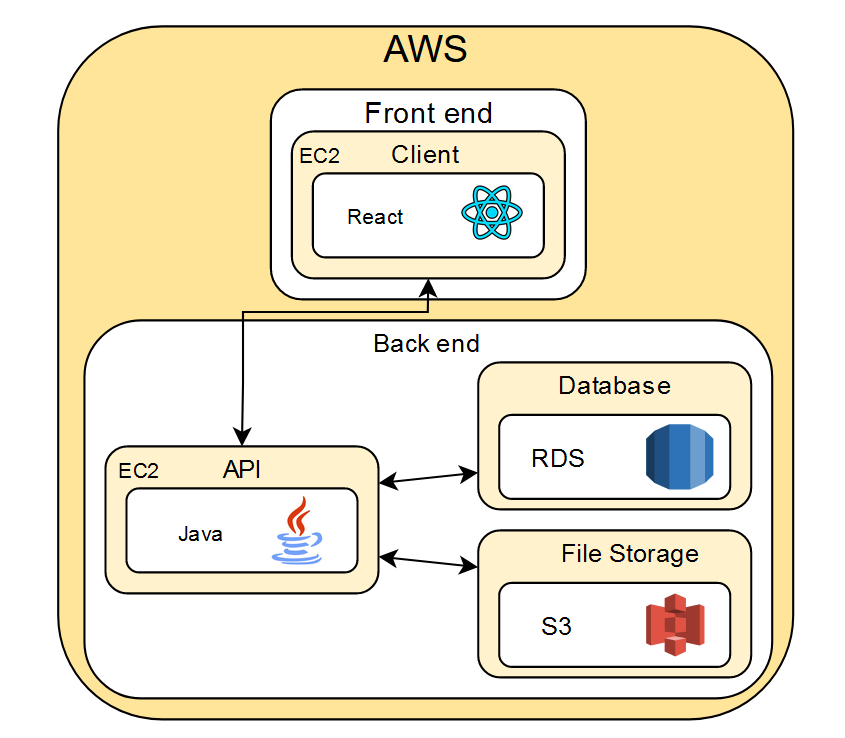

# rts-labs
Repo to house code created for rts labs interview

Problem Statement:
RTS is building a new Web App for a client that will be hosted on a public cloud. The app will consist of:

- A react frontend: The FE team will deliver a build script that will produce all needed static files.
- A java backend: The backend team will provide a build script that will produce a docker image.
- File storage and a relational DB for data storage.

Acting as the only devops engineer on this project. The assignment is to design & implement all needed environments (dev, qa, uat, prod). Besides delivering the initial environments, RTS is responsible for long term production support as well.

---

## Architechture Diagram

Here is my proposed Architecture diagram. It uses two EC2 instances, one for the React front end and the other for the Java powered API. This API will communicate with an RDS instance for a Relational Database. It will also communicate with an S3 bucket for file storage.

---

## Infrastructure as Code Tool
For this project I will be using Terraform as the infrastructure as code tool.
